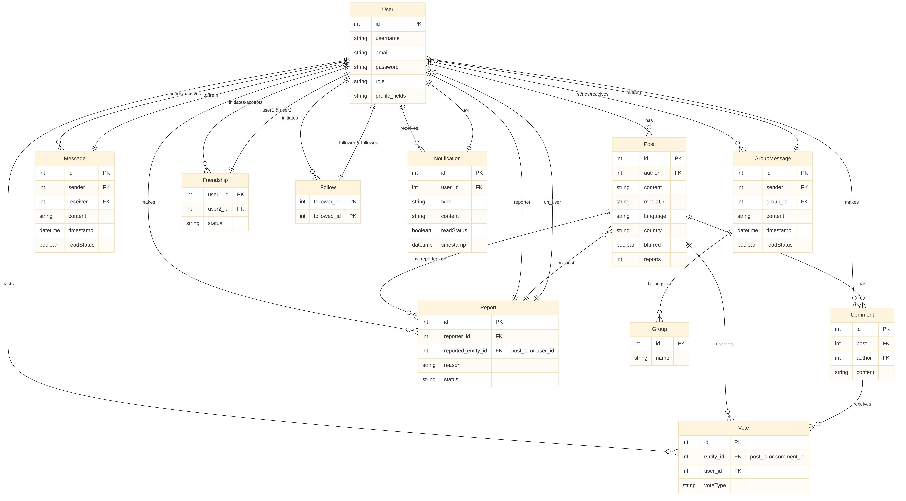

# 🌐 Social Network Backend
**Build:** Java · Spring Boot · Redis · WebSocket

A production-ready backend for a modern social networking platform built with **Spring Boot (Java 17)**.  
Features: secure JWT auth + blacklist, Redis-powered rate limiting & Pub/Sub, WebSocket/STOMP real-time messaging, Cloudinary media uploads, modular REST APIs (users, posts, comments, friends, messaging, notifications, admin), a **Smart Feed** with advanced filters & Saved Filters, moderation & blur workflows, and production-focused performance testing.

---

## 📑 Table of Contents
- ✨ [Highlights](#-highlights)  
- 🏗 [Architecture](#-architecture)  
- ⚙️ [Tech Stack](#️-tech-stack)  
- 🚀 [Feature Overview](#-feature-overview)  
- 🧠 [Smart Feed — Design & API](#-smart-feed—design--api)  
  - 🎯 [Scoring & Tuning](#-scoring--tuning)  
  - 🔁 [Pagination & Cursor Behavior](#-pagination--cursor-behavior)  
- 🧩 [Filtering System & Saved Filters](#-filtering-system--saved-filters)  
- 🔥 [Trending & Discovery](#-trending--discovery)  
- 🛡 [Moderation, Reports & Blurring](#-moderation-reports--blurring)  
- 🔌 [Detailed API Endpoints (complete)](#-detailed-api-endpoints-complete)  
- 🗄 [Data Model & Indexing Recommendations](#-data-model--indexing-recommendations)  
- 🔐 [Security & Rate Limiting](#-security--rate-limiting)  
- ⚡ [Real-Time (WebSocket/STOMP) — Examples](#-real-time-websocketstomp—examples)  
- 🧪 [Testing & Performance](#-testing--performance)  
- ▶️ [Run / Deployment](#️-run--deployment)  
- ⚙️ [Installation & Setup](#-installation--setup)  
- 💼 [Recruiter Talking Points](#-recruiter-talking-points)  
- 🔮 [Next Improvements / Roadmap](#-next-improvements--roadmap)

---

## ✨ Highlights
- ✅ JWT Auth (stateless) + Redis token blacklist — immediate logout / revocation.  
- ✅ Redis Rate Limiting (INCR + EXPIRE) — protects login endpoints.  
- ✅ Real-time chat: WebSocket + STOMP + Redis Pub/Sub (horizontally scalable).  
- ✅ Cloudinary integration for media uploads (posts & profile images).  
- ✅ Smart Feed: personalized ranking, filters, saved filters, cursor pagination.  
- ✅ Moderation: reports, admin queues, blur flags (`blurReason`).  
- ✅ Stress-tested: simulated 200k users & 500k posts to validate performance.

---

## 📊 Entity Relationship Diagram (ERD)
> (Place the ERD image in `./DOCS/social_network_erd.png`)

<p align="center">
  
</p>

---

## 🏗 Architecture (visual)
```

Clients (Web/Mobile)
├── REST API (Spring Boot controllers)
├── WebSocket STOMP (/ws) for real-time
↓
Spring Boot App
├── Controllers → Services → Repositories (Spring Data JPA)
├── JwtService, JwtAuthFilter, JwtBlacklistService
├── Redis:
│     ├─ String ops for RateLimiter
│     └─ RedisTemplate + Pub/Sub (chat\:messages)
└── Cloudinary integration (media)
Database (Postgres / MySQL)

```

---

## ⚙️ Tech Stack
- **Java 17** + **Spring Boot** (web, security, data-jpa, validation, websocket)  
- **Spring Security** + **JWT** (custom `JwtService`, `JwtAuthFilter`)  
- **Redis (Lettuce)** — rate limiting, caching, Pub/Sub  
- **WebSocket + STOMP** (SockJS fallback) + `SimpMessagingTemplate`  
- **Cloudinary** for image/video hosting  
- **Lombok**, DTOs, Bean Validation, Global Exception Handler  
- **JUnit**, Integration tests & Stress test harness

---

## 🚀 Feature Overview

### 👤 User
- Register / Login / Logout (JWT)  
- Profile CRUD (bio, job, location, age, profile/cover images)  
- Follow / Unfollow (one-way)  
- Friendship: send / accept / reject / block

### 📝 Posts
- Create / Edit / Delete posts (text + media)  
- Tags, language, country metadata  
- Blur flag + `blurReason` for moderation

### 🧠 Feed & Discovery
- Smart Feed (personalized) with filters & saved filters  
- Trending posts (time-windowed)

### 💬 Comments & Votes
- Add / Edit / Delete comments  
- Upvote / Downvote posts & comments

### ✉️ Messaging
- Private 1:1 chats (persisted)  
- Group chats (create, members, messages)  
- Real-time delivery via WebSocket + Redis

### 🔔 Notifications
- Event-driven notifications, mark-as-read

### 🛡 Admin & Moderation
- Ban users, delete posts/users  
- Moderator queues, most-reported posts  
- Reports & moderation endpoints

### 📂 Uploads
- `POST /api/upload` → Cloudinary URL

---

## 🧠 Smart Feed — Design & API
Design goals: personalization, freshness, quality, safety, and filterability.

### 🎯 Feed scoring (conceptual)
```

score(post, viewer) =
w\_follow   \* isFollowed(viewer, author)

* w\_friend   \* isFriend(viewer, author)
* w\_votes    \* log(1 + upvotes - downvotes)
* w\_recency  \* recencyBoost(ageSeconds)
* w\_engage   \* engagementScore(post)

- w\_reports  \* log(1 + reports)

* w\_viewed   \* viewerAffinity(viewer, author)

```
- `recencyBoost(age) = 1 / (1 + age / halfLife)` — halfLife configurable (e.g., 6h)  
- `engagementScore` uses recent comments/shares; `viewerAffinity` increases for prior interactions.  
- Default weights (tweakable): `follow=3, friend=4, votes=2, recency=3, reports=5, engagement=2`.

> Implementation tip: precompute `authorReputation`, store aggregated `posts.upvotes` and `posts.reports` for fast ranking.

---

### 🔁 Pagination & Cursor Behavior
- Support `page` (simple) and **cursor** (recommended) pagination.  
- Cursor = opaque token (e.g., base64 of `last_score,last_created_at`) — stable ordering while new posts arrive.  
- Recommended `size ≤ 50`.

---

## 🧩 Filtering System & Saved Filters
Filters are composable and can be passed via query params or JSON body.

### 🔍 Supported fields
- `authorId`, `authorName`  
- `tags` (any / `matchAll=true`)  
- `mediaOnly` (true/false)  
- `hasBlur` (true/false) — moderation  
- `minUpvotes`, `maxUpvotes`, `minScore`, `maxScore`  
- `since` / `until` (ISO datetime)  
- `language`, `country`  
- `followingOnly`, `friendsOnly`, `mutuals`  
- `contentContains` (full-text)  
- `reportedOnly` (moderation)

### 🧾 Example: Simple
```

GET /api/posts/feed?viewerId=5\&mediaOnly=true\&tags=travel,food\&minUpvotes=10

````

### 🧾 Example: Complex JSON (POST)
```json
POST /api/posts/feed/filtered
{
  "viewerId":5,
  "page":0,
  "size":20,
  "sortBy":"score",
  "filters": {
    "mediaOnly": true,
    "tags": ["travel","food"],
    "minUpvotes": 10,
    "since": "2025-08-01T00:00:00Z",
    "followingOnly": true
  }
}
````

### 💾 Saved Filters

* `POST /api/filters` — Save `{ userId, name, filter }`
* `GET /api/filters/{userId}` — List saved filters
* `GET /api/filters/{userId}/{filterId}` — Retrieve
* `DELETE /api/filters/{filterId}` — Delete
* Apply saved filter: `GET /api/posts/feed?viewerId=5&filterId=abc123`

---

## 🔥 Trending & Discovery

```
GET /api/posts/trending?timeWindow=24h&tags=tech&size=10
```

* Example trending score: `(upvotes * log(1+comments)) * freshnessMultiplier / (1 + log(1+reports))`.
* Cache top-K per segment (global, country, tag) using Redis sorted sets.

---

## 🛡 Moderation, Reports & Blurring

* `POST /api/reports/post/{postId}/user/{userId}` — file report (body: reason).
* If `reportsCount` exceeds thresholds, post may be auto-blurred or flagged.
* Posts include `blurred: boolean` and `blurReason: string`.
* Moderator endpoints:

  * `PUT /api/posts/{postId}/moderate` — set `blurred`, `blurReason`
  * `GET /api/admin/most-reported-posts` — paged by `reportsCount`
  * `GET /api/admin/reports` — list report objects

---

## 🔌 Detailed API Endpoints (complete)

> (Controllers should reflect these contracts and DTOs)

### Auth

* `POST /api/auth/signup` — `{ username, email, password }` → `AuthResponse { token, type, expiresIn }`
* `POST /api/auth/login` — `{ email, password }` → `AuthResponse`
* `POST /api/auth/logout` — Header `Authorization: Bearer <jwt>` → `200 OK` (token blacklisted)

### Profile

* `GET /api/profile/{userId}` → `UserProfileDTO`
* `PUT /api/profile/{userId}` → update profile

### Posts & Feed

* `POST /api/posts/{authorId}?content=...&mediaUrl=...` → create post
* `GET /api/posts/feed` → Smart feed
* `POST /api/posts/feed/filtered` → advanced feed
* `GET /api/posts/user/{authorId}/{viewerId}` → user posts (viewer context)
* `PUT /api/posts/{postId}/{userId}` → edit
* `DELETE /api/posts/{postId}/{userId}` → delete

### Comments

* `POST /api/comments/{postId}/{userId}` — body: content
* `GET /api/comments/post/{postId}?page=&size=`
* `PUT /api/comments/{commentId}/{userId}`
* `DELETE /api/comments/{commentId}/{userId}`

### Votes

* `POST /api/votes/post/{postId}/user/{userId}?voteType=UP|DOWN`
* `GET /api/votes/post/{postId}/upvotes` / `downvotes`
* (Same for comment votes)

### Follow

* `POST /api/follow/{followerId}/follow/{followingId}`
* `DELETE /api/follow/{followerId}/unfollow/{followingId}`
* `GET /api/follow/{userId}/followers` / `following`

### Friendship

* `POST /api/friends/send/{requesterId}/{receiverId}`
* `POST /api/friends/accept/{friendshipId}` / `reject` / `block`
* `GET /api/friends/list/{userId}`, `/pending/received/{userId}`, `/pending/sent/{userId}`

### Messaging (REST)

* `POST /api/messages/send/{senderId}/{receiverId}` — body: content → returns `MessageResponseDTO`
* `GET /api/messages/conversation/{user1Id}/{user2Id}?page=&size=`
* `DELETE /api/messages/{messageId}/{userId}`

### Groups (chat)

* `POST /api/groups/create?name=...` body: `[memberIds]`
* `POST /api/groups/{groupId}/add-member/{userId}`
* `POST /api/groups/{groupId}/send/{senderId}`
* `GET /api/groups/{groupId}/messages`

### Notifications

* `POST /api/notifications/{recipientId}` — create notification
* `GET /api/notifications/{userId}` — list
* `POST /api/notifications/read/{notificationId}`

### Uploads

* `POST /api/upload` — multipart file → `{ "url": "<cloudinary_url>" }`

### Admin

* `POST /api/admin/ban-user/{userId}`
* `DELETE /api/admin/delete-user/{userId}`
* `DELETE /api/admin/delete-post/{postId}`
* `GET /api/admin/user-stats`
* `GET /api/admin/post-stats`
* `GET /api/admin/top-authors?page=&size=&sortBy=&direction=`
* `GET /api/admin/most-reported-posts?page=&size=&sortBy=&direction=`

### Filters & Search

* `POST /api/filters` — save filter
* `GET /api/filters/{userId}`
* `GET /api/filters/{userId}/{filterId}`
* `DELETE /api/filters/{filterId}`
* `GET /api/search/posts?q=...&page=&size=&tags=&language=...`

---

## 🗄 Data Model & Indexing Recommendations

Key entities: `User`, `Post`, `Comment`, `Vote`, `Message`, `Group`, `Friendship`, `Follow`, `Notification`, `Report`, `SavedFilter`.

### Suggested indexes

* `posts(created_at)` — recency ordering
* `posts(author_id)` — author filters
* `posts(language)`, `posts(country)` — locale filters
* `post_tags(post_id, tag_id)` composite index
* Aggregated counters on `posts` (`upvotes`, `reports`) for fast reads
* `messages(conversation_id, created_at)` — conversation retrieval
* Full-text search: Postgres `tsvector` on `posts.content` for `contentContains`

### Caching / Materialization

* Materialized views for top posts by tag/country
* Redis sorted sets for top-K trending per segment
* Cache feed top results per segment (country/follow bucket) and personalized deltas

---

## 🔐 Security & Rate Limiting

* JWT: configure `security.jwt.secret` & `security.jwt.expiration` (seconds)
* Logout: blacklisted tokens in Redis with TTL = remaining token life
* Rate limiter: `rl:login:{email}:{ip}` — `INCR` + `EXPIRE` (defaults: `loginMaxAttempts=5`, `loginWindowSeconds=60`)
* RBAC: `ROLE_USER` / `ROLE_ADMIN` (enforced in `SecurityConfig`)
* Custom handlers: AuthenticationEntryPoint (401), AccessDeniedHandler (403), `ApiExceptionHandler` (validation)

---

## ⚡ Real-Time (WebSocket/STOMP) — Examples

**Endpoint:** `/ws` (SockJS fallback) — STOMP prefix `/app`, broker `/topic` & `/queue`, user prefix `/user`.

**Handshake:** `JwtHandshakeInterceptor` validates `Authorization: Bearer <token>` and sets `Principal`.

**STOMP mappings**

* Subscribe private: `/user/queue/private`
* Subscribe group: `/topic/group.{groupId}`
* Send private: `/app/private.send` — payload `{ receiverId, content }`
* Send group: `/app/group.send` — payload `{ groupId, content }`

**JS example**

```js
const sock = new SockJS('http://localhost:8080/ws');
const client = Stomp.over(sock);

client.connect({ Authorization: 'Bearer ' + token }, () => {
  client.subscribe('/user/queue/private', m => console.log('private', JSON.parse(m.body)));
  client.subscribe('/topic/group.7', m => console.log('group', JSON.parse(m.body)));
  client.send('/app/private.send', {}, JSON.stringify({ receiverId: 42, content: 'Hello' }));
});
```

**Scaling note:** messages are published to Redis channel `chat:messages` and each instance forwards to its local sessions.

---

## 🧪 Testing & Performance

* **Unit tests:** services, controllers, utilities (feed scoring, filter parsing)
* **Integration tests:** auth flows, JWT blacklisting, WebSocket handshake + messaging
* **Concurrency stress tests:** harness generating \~200k users & 500k posts; optimized feed & analytics queries run in \~1.3 minutes in benchmark environment (dependent on hardware)
* **Recommendations:** cache feeds/top-K, materialize heavy aggregations, optimize DB indexes

---

## ▶️ Run / Deployment

See the **Installation & Setup** section below for full setup instructions, Docker Compose example, running tests, and troubleshooting tips.

---

## ⚙️ Installation & Setup

### ✅ Prerequisites

* Java 17 (OpenJDK 17)
* Maven 3.8+ (or use the included `./mvnw`)
* PostgreSQL or MySQL (example uses Postgres)
* Redis (for cache, rate limiter, and pub/sub)
* (Optional) Docker & Docker Compose — recommended for quick local dev
* Cloudinary account (for media uploads) — `cloud_name`, `api_key`, `api_secret`

---

### 🔐 Environment variables / `application.yml` (example)

Create `src/main/resources/application.yml` or set environment variables. Example:

```yaml
server:
  port: 8080

security:
  jwt:
    secret: "CHANGE_THIS_TO_A_STRONG_SECRET"
    expiration: 36000

spring:
  datasource:
    url: jdbc:postgresql://localhost:5432/socialnetwork
    username: dbuser
    password: dbpass
  jpa:
    hibernate:
      ddl-auto: update
    show-sql: false

spring:
  redis:
    host: localhost
    port: 6379

cloudinary:
  cloud_name: your_cloud_name
  api_key: your_api_key
  api_secret: your_api_secret

rate:
  limit:
    loginMaxAttempts: 5
    loginWindowSeconds: 60
```

> **Do not commit secrets.** Use environment variables, `.env` or your deployment platform's secret manager.

---

### 🧭 Local dev (quickstart)

1. Clone:

```bash
git clone https://github.com/YoussefHassanDEV/socialnetwork-backend.git
cd socialnetwork-backend
```

2. Create `application.yml` (or set env vars) — see above.
3. Start Postgres & Redis locally (or via Docker).
4. Build & run:

```bash
# using maven wrapper
./mvnw clean package
./mvnw spring-boot:run
```

or:

```bash
java -jar target/socialnetwork-backend-0.0.1-SNAPSHOT.jar
```

5. Access APIs at `http://localhost:8080/api` and WebSocket at `ws://localhost:8080/ws`.

---

### 🐳 Docker Compose (recommended)

Create `docker-compose.yml` at repo root (example):

```yaml
version: "3.8"
services:
  postgres:
    image: postgres:14
    restart: unless-stopped
    environment:
      POSTGRES_USER: dbuser
      POSTGRES_PASSWORD: dbpass
      POSTGRES_DB: socialnetwork
    ports:
      - "5432:5432"
    volumes:
      - db-data:/var/lib/postgresql/data

  redis:
    image: redis:7
    ports:
      - "6379:6379"
    volumes:
      - redis-data:/data

  app:
    build: .
    image: socialnetwork-backend:local
    ports:
      - "8080:8080"
    environment:
      SPRING_DATASOURCE_URL: jdbc:postgresql://postgres:5432/socialnetwork
      SPRING_DATASOURCE_USERNAME: dbuser
      SPRING_DATASOURCE_PASSWORD: dbpass
      SPRING_REDIS_HOST: redis
      SECURITY_JWT_SECRET: "CHANGE_THIS_SECRET"
      CLOUDINARY_CLOUD_NAME: ${CLOUDINARY_CLOUD_NAME}
      CLOUDINARY_API_KEY: ${CLOUDINARY_API_KEY}
      CLOUDINARY_API_SECRET: ${CLOUDINARY_API_SECRET}
    depends_on:
      - postgres
      - redis

volumes:
  db-data:
  redis-data:
```

Start:

```bash
docker-compose up --build
```

---

### 🧪 Running tests & stress tests

* Unit & integration:

```bash
./mvnw test
```

* Stress tests (if included):

```bash
./mvnw -Dtest=RepositoryConcurrentStressTest test
```

> Run stress tests against a dedicated DB instance — they require generous resources.

---

### 🧩 Seed data (optional)

Add `data.sql` or a `CommandLineRunner` for dev profile to create demo users/posts. Example SQL:

```sql
INSERT INTO users (username, email, password_hash, role, enabled, created_at)
VALUES ('alice', 'alice@example.com', '<bcrypt-hash>', 'USER', true, now());
```

---

### 🔧 Useful environment variables (examples)

```bash
export SPRING_DATASOURCE_URL=jdbc:postgresql://localhost:5432/socialnetwork
export SPRING_DATASOURCE_USERNAME=dbuser
export SPRING_DATASOURCE_PASSWORD=dbpass
export SPRING_REDIS_HOST=localhost
export SPRING_REDIS_PORT=6379
export SECURITY_JWT_SECRET="change_me_to_strong_random"
export CLOUDINARY_CLOUD_NAME="your-cloud"
export CLOUDINARY_API_KEY="..."
export CLOUDINARY_API_SECRET="..."
```

---

### ⚠️ Troubleshooting

* **404 on API:** confirm server is running & base path `/api`.
* **DB connection errors:** check DB URL, credentials, and that DB is running.
* **Redis errors:** ensure Redis reachable and host/port match config.
* **Cloudinary failures:** verify cloud credentials.
* **WebSocket connection issues:** check handshake JWT header and `ws` endpoint path.

---

### 🧩 Production checklist (quick)

* Use migration tool (Flyway/Liquibase) + `spring.jpa.hibernate.ddl-auto=validate`.
* Store secrets in vault/secret manager.
* Configure HTTPS (TLS) + reverse proxy.
* Add monitoring (Prometheus + Grafana).
* Load test & tune DB indexes and Redis configs.

---

## 💼 Recruiter Talking Points

* Built a production-ready backend (JWT blacklist, rate limiter).
* Designed & implemented a personalized Smart Feed + filters + saved filters.
* Implemented scalable real-time chat (WebSocket/STOMP + Redis Pub/Sub).
* Integrated Cloudinary for media handling.
* Performed concurrency stress tests (200k users, 500k posts).
* Clean architecture: Controllers → Services → Repositories; good test coverage.

---

## 🔮 Next Improvements / Roadmap

* Add **OpenAPI / Swagger** auto-generated docs.
* Publish **Postman / Insomnia** collection.
* Dockerize + provide Helm chart for K8s.
* Add **Prometheus + Grafana** monitoring & alerts.
* Integrate **ElasticSearch** or recommender ML service for advanced search & ranking.
* Implement **AI moderation** to auto-flag/blur inappropriate content.

---

Thanks — this `README.md` includes everything (overview, APIs, Smart Feed, filters, ERD placeholder, and full installation steps).

```
```
